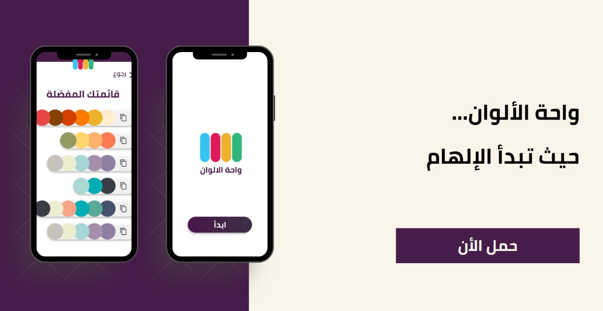

# Color palette 🎨

  

## فكرة التطبيق
تطبيق يساعدك على توليد ألوان متناسقة بصريًا سواء كنت مصمم أو مطور، وده من خلال اختيارات لأنماط الألوان وعددها، مع القدرة على تخصيصها وحفظها.

## مميزات التطبيق
- توليد 3 أو 6 ألوان متناسقة.
- أنماط ألوان متنوعة (باردة، دافئة، أحادية، ساطعة، داكنة).
- قفل الألوان اللي عجبتك وتوليد باقي الألوان من جديد.
- تعديل الألوان يدويًا.
- حفظ الألوان في المفضلة وحذفها.

## 🛠️ التقنيات المستخدمة

- Flutter
- Dart
- provider لإدارة الحالة
- SharedPreferences (لحفظ الألوان المفضلة)

## مدة التنفيذ
مايو 2022 – يونيو 2022

## صور من التطبيق

  
  
  

## 👋 تواصل معي

هل عندك أي سؤال؟ تقدر تتواصل معايا على [LinkedIn](https://www.linkedin.com/in/ansbedoor)
